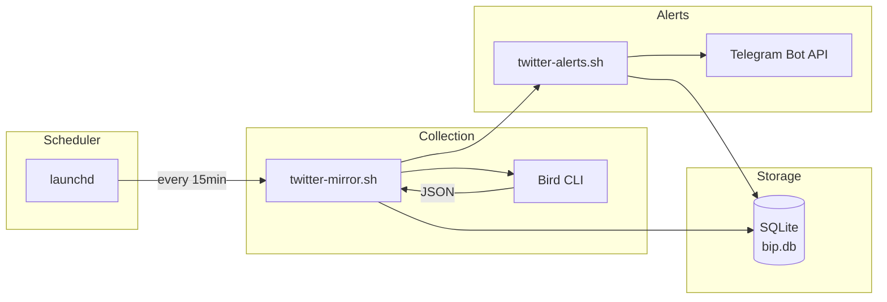

# Architecture

> BIP Buddy Phase 1: Twitter Activity Mirror & Alerts

---

## System Overview



---

## Components

| Component | Location | Purpose |
|-----------|----------|---------|
| **init-db.sh** | `.ai/scripts/init-db.sh` | Creates SQLite schema (4 tables) |
| **twitter-mirror.sh** | `.ai/scripts/twitter-mirror.sh` | Collects tweets via Bird CLI, saves to DB |
| **twitter-alerts.sh** | `.ai/scripts/twitter-alerts.sh` | Sends Telegram alerts for growth events |
| **setup.sh** | `.ai/setup.sh` | Symlinks skills/scripts to ClawdBot |

---

## Data Flow

### 1. Collection (twitter-mirror.sh)

1. Bird CLI fetches last 20 tweets for `@Toporcalibur`
2. Extracts profile metrics (followers, following) from first tweet's `_raw`
3. Saves profile snapshot to `profile_snapshots` table
4. For each tweet:
   - If new: INSERT into `tweets` table
   - If exists: UPDATE metrics (likes, replies, retweets, views)
5. Triggers alerts check

### 2. Alerts (twitter-alerts.sh)

1. Reads ClawdBot config for Telegram credentials
2. Checks for tweet growth:
   - Tweets with >= 50 likes
   - Updated in last 2 hours
   - Created within last 7 days
3. Checks for follower growth:
   - Compares current vs 24h ago
   - Alerts if growth >= 10
4. Sends alerts via Telegram Bot API
5. Records sent alerts in `alerts_sent` table (deduplication)

---

## Database Schema

```sql
-- Снимки твитов с метриками
CREATE TABLE tweets (
  id INTEGER PRIMARY KEY AUTOINCREMENT,
  tweet_id TEXT UNIQUE NOT NULL,
  content TEXT NOT NULL,
  created_at DATETIME NOT NULL,
  snapshot_at DATETIME DEFAULT CURRENT_TIMESTAMP,
  likes INTEGER DEFAULT 0,
  replies INTEGER DEFAULT 0,
  retweets INTEGER DEFAULT 0,
  views INTEGER DEFAULT 0
);

-- История профиля
CREATE TABLE profile_snapshots (
  id INTEGER PRIMARY KEY AUTOINCREMENT,
  snapshot_at DATETIME DEFAULT CURRENT_TIMESTAMP,
  followers INTEGER DEFAULT 0,
  following INTEGER DEFAULT 0
);

-- Драфты и контент-календарь (Phase 2)
CREATE TABLE drafts (
  id INTEGER PRIMARY KEY AUTOINCREMENT,
  content TEXT NOT NULL,
  source TEXT NOT NULL CHECK (source IN ('session', 'watchlist', 'manual')),
  source_ref TEXT,
  status TEXT DEFAULT 'idea' CHECK (status IN ('idea', 'draft', 'reminded', 'posted', 'dropped')),
  remind_at DATETIME,
  created_at DATETIME DEFAULT CURRENT_TIMESTAMP,
  posted_at DATETIME,
  posted_tweet_id TEXT
);

-- Дедупликация алертов
CREATE TABLE alerts_sent (
  id INTEGER PRIMARY KEY AUTOINCREMENT,
  alert_type TEXT NOT NULL,
  ref_id TEXT NOT NULL,
  sent_at DATETIME DEFAULT CURRENT_TIMESTAMP
);
```

### Indexes

| Index | Table | Columns | Purpose |
|-------|-------|---------|---------|
| `idx_tweets_snapshot_at` | tweets | snapshot_at | Recent updates query |
| `idx_tweets_created_at` | tweets | created_at | Recent tweets query |
| `idx_profile_snapshots_at` | profile_snapshots | snapshot_at | Growth calculation |
| `idx_drafts_status` | drafts | status | Filter by status |
| `idx_drafts_remind_at` | drafts | remind_at | Reminder scheduling |
| `idx_alerts_type_ref` | alerts_sent | alert_type, ref_id | Deduplication check |

---

## Alert Thresholds

| Alert Type | Threshold | Check Period |
|------------|-----------|--------------|
| Tweet growth | >= 50 likes | Last 2 hours |
| Follower growth | >= 10 new | Last 24 hours |

---

## Error Handling

| Principle | Implementation |
|-----------|----------------|
| **Fail Fast** | `set -euo pipefail` in all scripts |
| **Graceful Degradation** | Tweet parsing errors logged, don't stop batch |
| **Deduplication** | `alerts_sent` table prevents duplicate alerts |
| **Retry Prevention** | Failed alerts marked as sent to avoid infinite loops |

---

## File Locations

```
bip-buddy/
├── .ai/
│   └── scripts/
│       ├── init-db.sh          # DB initialization
│       ├── twitter-mirror.sh   # Data collection
│       └── twitter-alerts.sh   # Alert generation
├── data/
│   └── bip.db                  # SQLite database (gitignored)
└── ~/.clawdbot/
    └── clawdbot.json           # Telegram bot credentials
```

---

## External Dependencies

| Dependency | Purpose | Install |
|------------|---------|---------|
| Bird CLI | Twitter scraping | `npm i -g @steipete/bird` |
| sqlite3 | Database | `brew install sqlite` |
| jq | JSON parsing | `brew install jq` |
| curl | HTTP requests | Built-in macOS |

---

*Last updated: 2026-01-19*
