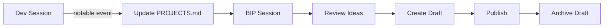

# Workflow: Standard Operating Procedure

## Daily/Session Flow



## During Development (Spoke-Side)

When working on any project:

1. **Notice** postable moments:
   - 🐛 Interesting bug and fix
   - 💡 Breakthrough or realization
   - 📸 Visual progress (GIF-worthy)
   - 🎯 Feature completion

2. **Quick capture** (in the project OR here):
   - Add to `PROJECTS.md` → project's "Content Hooks"
   - Or create quick note in `ideas/`

## BIP Session (Weekly/As-Needed)

1. **Open** this `bip-buddy/` as primary workspace
2. **Scan** `PROJECTS.md` for highlights
3. **Review** `ideas/backlog.md` for queued content
4. **Draft** in `drafts/[platform]-[topic].md`
5. **Post** and move draft to archive

## Content Lifecycle

```
ideas/ → drafts/ → [publish] → archive/
```

## Agent Behaviors

### During Dev Sessions (Default: Silent Mode)
- **Log silently** postable moments to `ideas/session-log.md`
- **No interruptions** — creator owns attention
- Only speak about BIP when explicitly asked

### On `/wrap` or Session End
- Offer **Session Summary**: "2 postable moments today: [X], [Y]. Drafts?"
- Creator decides what (if anything) to develop

### During BIP Sessions
- **Scan** all projects for recent activity
- **Review** session-log for accumulated moments
- **Draft** if asked, maintaining Jester-Sage voice
